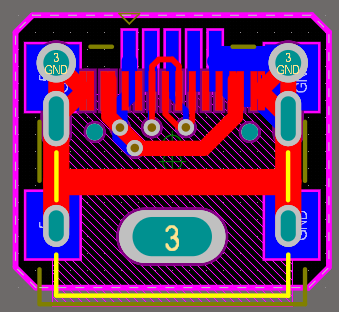

# Mini-USB 转接板

## 测试中-- 外观预计还行，牢固程度 ≈ 原本 Mini-USB

拆掉原本的插座，使用一个底部是镜像 Mini-USB 焊盘的转接板在原位置进行转换

注意：本板不可以逆转换，有短路风险

## 第一版本

### PCB效果：

### 使用效果：

第一次测试：

### 总结：

安装前需先对 miniUSB 引线位置进行打磨，使焊盘能够达到 PCB 边缘以方便焊接

过孔未盖油，导致使用时需要先处理过孔。

PCB厚度选择不当，过薄，建议使用1.2mm~1.4厚度

总之，凑合凑合能用（