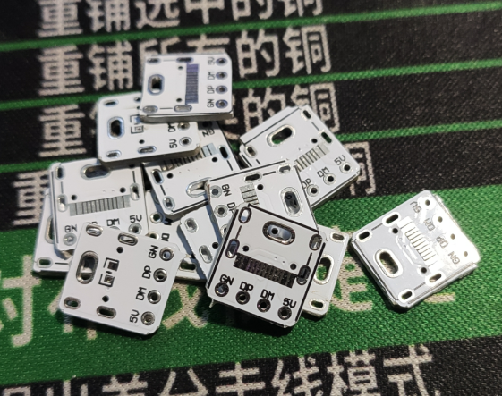
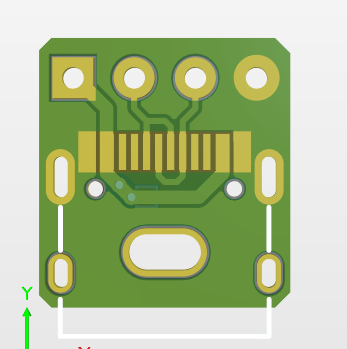
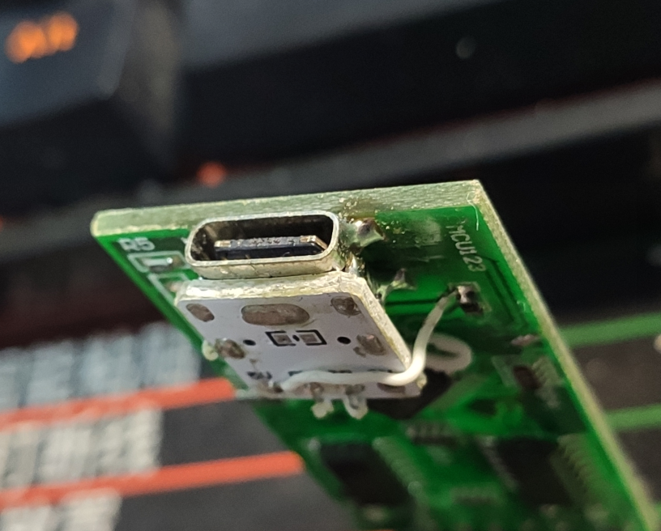
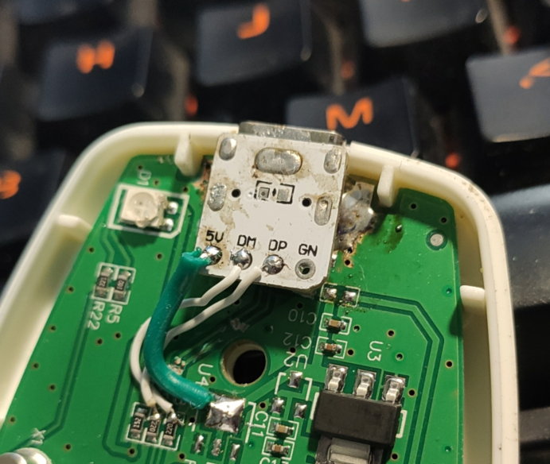
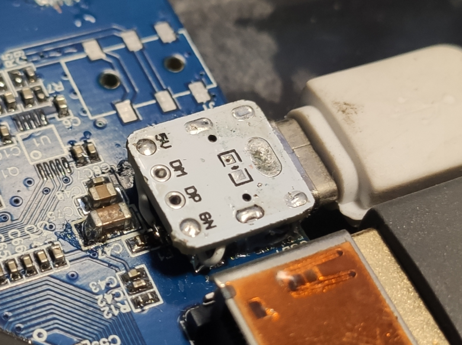

# 基本转接板

## 对外观没什么要求，讲究结实通用

就是拆掉原本的插座，底部做好绝缘(不要将原插座的焊盘短路)，然后倒着装上这个再飞线连接（

注意：TypeC金属壳与GND焊盘连接

### PCB效果：

(↑不是同一次制作)

--- 
 

--- 

### 使用效果：

↑这里圆孔的上侧和左侧都有割断原本插座的USB线。GND在电路板上作为铺铜，转接板的GND又与插座外壳相连，所以没有为GND飞线。

--- 

