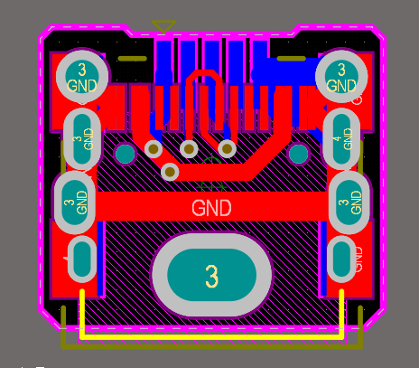
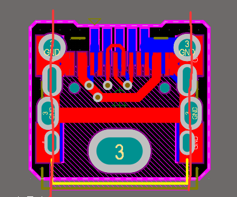
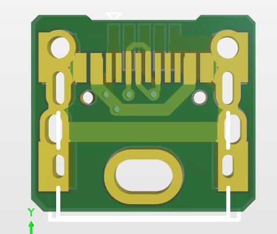
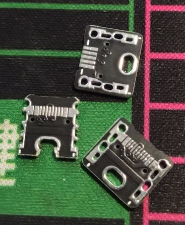
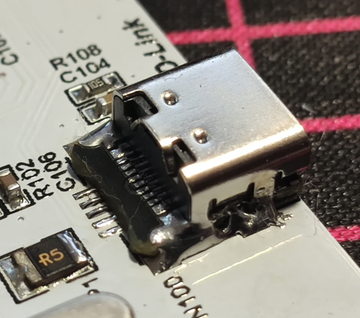
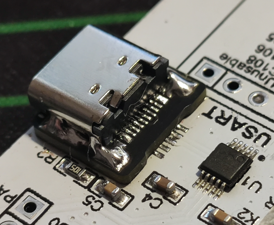

# Mini-USB 转接板

## 测试中-- 外观预计还行，牢固程度 ≈ 原本 Mini-USB

拆掉原本的插座，使用一个底部是镜像 Mini-USB 焊盘的转接板在原位置进行转换

注意：本板不可以逆转换，有短路&反接风险

## 第二版本

第一版本移动至 old 文件夹。

### PCB效果：

↑ 切断之后可以大幅度降低焊接难度

 
--- 

### 使用效果：

↑ 确实降低了一些焊接难度，不切的话使用风枪更合适一些

### 变更：

过孔加盖油

固定脚扩大上锡空间

左右两侧添加一个焊盘

中部固定孔扩大

形状略微改变

